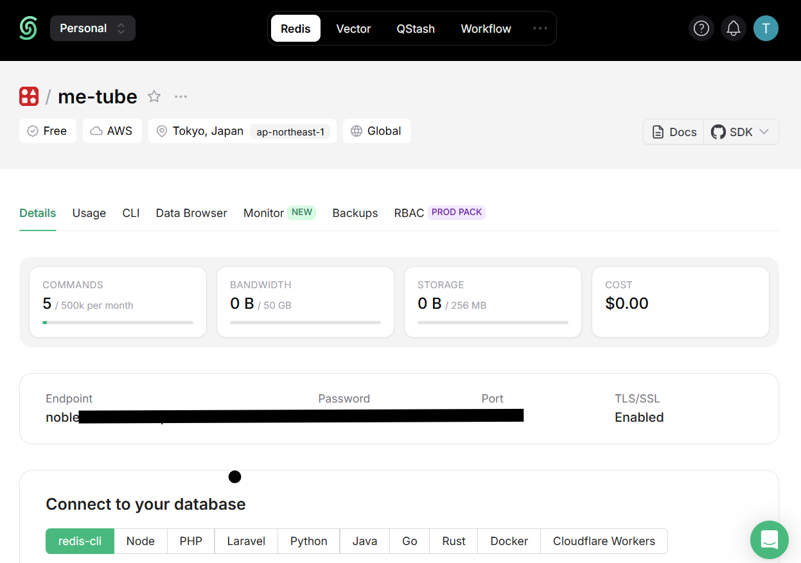
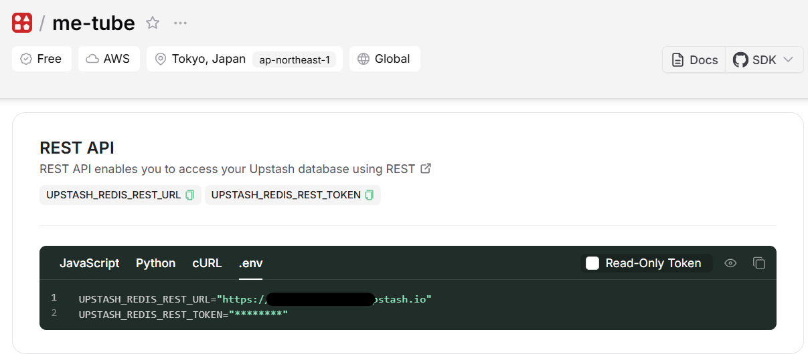
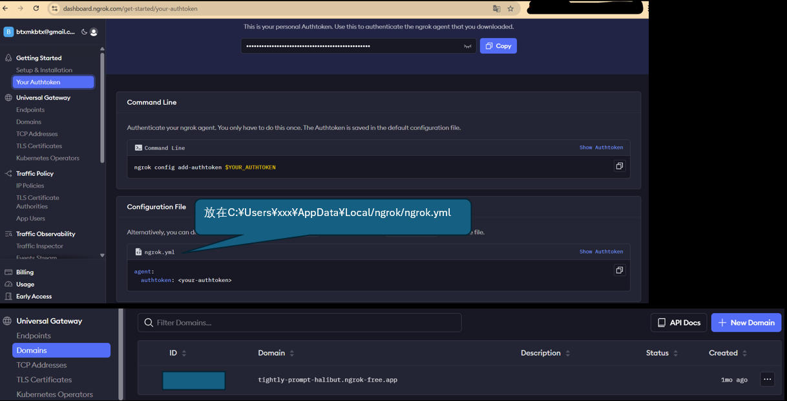
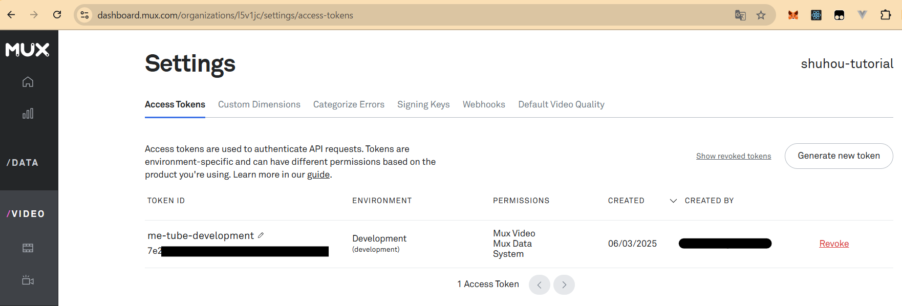
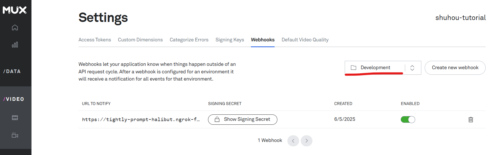

# Clerk Auth

## 平台信息

github account login

[API KEY](https://dashboard.clerk.com/apps/app_2h3rVTIOKEjDPMvkButuenB43ro/instances/ins_2h3rVayUgo9oHxXrn0Wi3DaLVqX/api-keys)设置到 env 中<br/>


## 认证中间件

src\middleware.ts<br/>
用来测试中间件拦截器页面的页面:src\app\(studio)\studio\page.tsx

# DB

## postgre

谷歌邮箱登录
[neon postgresql](https://console.neon.tech/app/projects/billowing-unit-66449389?database=metube)<br/>


## redis

引入 redis 对认证登录请求计数，限制恶意暴刷我们的 clerk 认证服务。
代码实现：
src\trpc\init.ts
src\lib\ratelimit.ts

谷歌邮箱登录[无服务平台 upstash](https://console.upstash.com/)



# drizzle

Drizzle 是一个现代的 TypeScript 优先 的 ORM（对象关系映射）工具，它诞生是为了解决以下几个数据库开发中的痛点：<br/>


drizzle sample<br/>


drizzle vs prisma<br/>


## Drizzle vs Prisma 对比表

| 特性               | 🧪 Drizzle ORM                             | 🌈 Prisma ORM                               |
| ------------------ | ------------------------------------------ | ------------------------------------------- |
| **语言风格**       | TypeScript-first，显式代码                 | Schema-first，使用 Prisma 自定义 DSL        |
| **SQL 可见性**     | ✅ 显式构建 SQL，SQL 语义可读              | ❌ 自动生成查询，SQL 不可见                 |
| **类型安全**       | ✅ 完全类型安全，推导到字段级              | ✅ 查询结果类型安全（但 SQL 构建不透明）    |
| **迁移机制**       | ✅ 代码即 schema，强一致性                 | ❌ 需要额外维护 `.prisma` schema 和迁移文件 |
| **运行时依赖**     | ❌ 无运行时魔法或生成器                    | ✅ 依赖代码生成器和运行时客户端             |
| **学习曲线**       | ✅ 熟悉 SQL 就能用                         | ⛔ 需要学习 Prisma schema DSL               |
| **调试体验**       | ✅ SQL 可见，易调试                        | ❌ SQL 隐藏，调试需依赖日志                 |
| **性能开销**       | ✅ 极轻量、无 ORM 中间层                   | ⛔ Prisma Client 较重，可能影响冷启动       |
| **使用环境兼容性** | ✅ 支持 Edge Functions、Bun、Serverless    | ❌ 在某些 Edge 环境中运行不稳定             |
| **数据库支持**     | PostgreSQL、MySQL、SQLite（计划支持更多）  | PostgreSQL、MySQL、SQLite、MongoDB 等       |
| **社区与生态**     | 新兴中，轻量级方向                         | 成熟、生态丰富                              |
| **适合人群**       | 注重性能、喜欢 SQL、重视类型一致性的开发者 | 追求开发效率、自动化、企业项目              |

## Get Start

neon postgresql:https://orm.drizzle.team/docs/get-started/neon-new
<br/>
local postgresql:https://orm.drizzle.team/docs/get-started/postgresql-new

## 推送数据库表

1. 在 db 文件夹中完成下面三个基础文件创建。<br/>
   drizzle.config.ts<br/>
   src\db\index.ts<br/>
   src\db\schema.ts<br/>
2. 通过 drizzle-kit 命令包中的 push 命令，推送 Table 到数据库中。<br/>
   **★ 每次修改各个表的 schema 都需要推送**<br/>
   bunx drizzle-kit push

```bash
PS D:\02_ALL_WORKSPACE\reactWK\nextjs-study\next15-youtube-clone> bunx drizzle-kit push
No config path provided, using default 'drizzle.config.ts'
Reading config file 'D:\02_ALL_WORKSPACE\reactWK\nextjs-study\next15-youtube-clone\drizzle.config.ts'Using '@neondatabase/serverless' driver for database querying
 Warning  '@neondatabase/serverless' can only connect to remote Neon/Vercel Postgres/Supabase instances through a websocket
[✓] Pulling schema from database...
[✓] Changes applied
```

推送完成后去数据库确认表创建成功<br/>


完成 drizzle 的表推送后，也可以通过 drizzle 的 studio 客户端打开数据库。

```bash
bunx drizzle-kit studio
```

## relations

在代码层面帮助我们完成表关联查询的语法，相当于在 java 中取出两个表的 list 集合，再通过遍历来关联两个集合得到一个新的集合<br/>
以下是官网对比使用 relations 和 leftJoin 的区别<br/>
https://orm.drizzle.team/docs/relations

# Webhook Sync

Webhook Sync 的诞生是为了替代低效的轮询模式，通过事件驱动模式实现——仅在数据变化时主动推送（Push），避免无效查询。
**其实就是给第三方服务提供一个我们自定义的 API，让第三方服务主动调用我们的 API。**<br/>
在我们这个项目中的实际应用有以下几处：

1. clerk 平台对 user 进行增删改时，调用我们的 API 维护 user 表。[详细](## clerk-webhook)

Webhook Sync 解决的核心问题：<br/>
(1) 实时性需求<br/>
场景：支付成功通知、订单状态更新、GitHub 代码推送等。<br/>
方案：服务方（如支付系统）通过 Webhook 立即 将事件推送给订阅方，实现秒级同步。

(2) 系统解耦<br/>
问题：紧耦合系统（如直接 API 调用）会因依赖方故障引发连锁反应。<br/>
方案：Webhook 通过 HTTP 回调通知，发送方和接收方完全解耦，仅需约定消息格式。

(3) 降低服务器压力<br/>
对比轮询：1000 个客户端轮询 1 次/秒 → 每秒 1000 次请求。<br/>
Webhook 模式：只有事件发生时触发，可能全天仅需 10 次请求。<br/>

## [ngrok](https://dashboard.ngrok.com/get-started/setup/windows)

因为第三方服务（如：clerk）无法直接发送请求到我们的 localhost 上，只能发送请求到一个对外公布的域名。<br/>
因此需要通过下面步骤建立一个静态域名映射，便于将 webhook 的请求转发给 localhost

1. choco install ngrok 在 windows 上会因为杀毒软件导致 access error，建议直接在上面官网下载 ngrok.exe，打开 ngrok.exe 文件弹出 cmd 对话框。<br/>
   D:\03_software\ngrok-v3-stable-windows-amd64\ngrok.exe
2. 按照官网 step2 配置 ngrok config add-authtoken，<br/>
   文件路径：C:\Users\Zhupeng\AppData\Local/ngrok/ngrok.yml。
   
3. bun run dev,默认 port 应该是 3000
4. 建立域名与 localhost300 的映射:<br/>
   ngrok http --url=tightly-prompt-halibut.ngrok-free.app 3000
   <br/>如果上面的命令运行错误，试试把--url 改成--domain
   

## [clerk webhook](https://dashboard.clerk.com/apps/app_2h3rVTIOKEjDPMvkButuenB43ro/instances/ins_2h3rVayUgo9oHxXrn0Wi3DaLVqX/webhooks)

1. 新建一个 webhook endpoint<br/>
   
2. 把 Signing Secret 设置到 env 中
   

## Svix

Svix 的诞生是为了解决 企业级 Webhook 可靠性和规模化 的核心问题。以下是其核心定位和解决的痛点：<br/>

### 原生 Webhook 的局限性

开发者直接使用 Webhook 时面临的主要挑战：

1. 可靠性差：接收方服务宕机或网络波动会导致消息丢失。
2. 缺乏可观测性：无法追踪 Webhook 的送达状态、重试历史。
3. 安全风险：伪造请求（如中间人攻击）、签名验证复杂。
4. 规模化困难：高并发下自建 Webhook 系统难以保证性能和顺序性。

## 测试 webhook 是否正常运行

登录自己的 clerk，打开[users 管理界面](https://dashboard.clerk.com/apps/app_2h3rVTIOKEjDPMvkButuenB43ro/instances/ins_2h3rVayUgo9oHxXrn0Wi3DaLVqX/users),随意进行增删查改的操作，<br/>
再到[自己的数据库](https://console.neon.tech/app/projects/billowing-unit-66449389/branches/br-tiny-dew-a1dwl43a/tables?database=metube)中确认 src\app\api\users\webhook\route.ts 的 webhook api 是否被触发执行，是否正确的对 users 表进行增删改查。

# tRPC

tRPC（TypeScript Remote Procedure Call）是为了解决前后端类型不一致、API 接口重复定义、以及传统 REST 或 GraphQL 带来的额外负担等问题而诞生的。

## 适用场景：

1. 使用 TypeScript 开发的全栈项目；
2. 希望在 开发阶段就捕捉接口错误；
3. 项目不需要 GraphQL 的复杂性，但仍想要良好的类型安全和开发体验；
4. 特别适合与 Next.js（或任意 React 框架）搭配使用。

## 此項目的 trpc 核心文件架構

1. 核心組件导出：src\trpc\init.ts<br/>
   通过 F12 查看 createTRPCRouter，createCallerFactory，protectedProcedure 三大核心的使用位置<br/>
   **createTRPCRouter**用于生成所有 API 的入口路由：src\trpc\routers_app.ts<br/>
   API 的入口路由生成后注册到 src\app\api\trpc\[trpc]\route.ts 中就可以生效了。
2. API 的 contoller 实现方式，与 hone 封装 restfulAPI 接口的方式很相似<br/>
   API 入口文件:src\app\api\trpc\[trpc]\route.ts<br/>
   API 注册文件:src\trpc\routers_app.ts<br/>
   API 实装文件：各个 procedures.ts
3. API 的调用方式<br/>
   trpc 服务端取出数据放入缓存：src\app\(home)\page.tsx<br/>
   trpc 客户端从缓存中提取数据：src\modules\home\ui\sections\categories-section.tsx
4. HydrateClient<br/>
   在 @trpc/react-query/rsc 中，createHydrationHelpers 提供的 HydrateClient 是一个专门用于 在 RSC (React Server Components) 环境下实现 TRPC 状态 hydration 的客户端组件。它的核心作用是将服务端预获取的 TRPC 查询状态安全地注入到客户端，因为有了 HydrateClient 的注入，src\modules\home\ui\sections\categories-section.tsx 中的 useSuspenseQuery 才能够拿得到服务端缓存的数据。
5. useSuspenseQuery 拿到的缓存数据需要通过 trpc 的 prefetch 来完成缓存注入。<br/>
   **注意:**prefetch 不能再 layout 文件中工作。只能在 page 中工作。
6. useSuspenseInfiniteQuery 拿到的缓存数据需要通过 trpc 的 prefetchInfinite 来完成缓存注入。<br/>
   **注意:**prefetchInfinite 不能再 layout 文件中工作。只能在 page 中工作。

# Mux 视频托管

谷歌邮箱登录 Mux 平台



## webhook for mux

mux 的 webhook 是自己封装的库，不需要借助 Svix<br/>
代码:src\app\api\videos\webhook\route.ts
