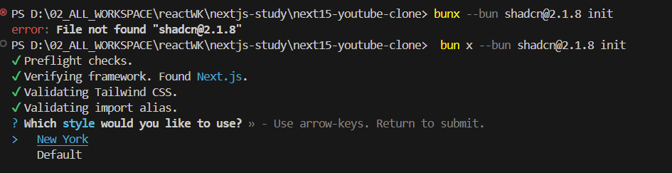

# package add list

## 新建项目

如果需要新建一个空项目，执行：bun create next-app my-app

## UI 库

bunx --bun shadcn@2.1.0 init

有可能遇到一个奇葩错误，需要把 bunx 改成 bun x

## clerk 认证服务集成

bun add @clerk/nextjs@6.10.3

## drizzle

bun add drizzle-orm@0.39.0 @neondatabase/serverless@0.10.4 dotenv@16.4.7
 
bun add -D drizzle-kit@0.30.3 tsx@4.19.2
 
bun add drizzle-zod@0.7.0

## svix

bun add svix@1.45.1

## trpc

bun add @trpc/server@11.0.0-rc.730

bun add @trpc/client@11.0.0-rc.730

bun add @trpc/react-query@11.0.0-rc.730

bun add @tanstack/react-query@5.65.1

bun add zod client-only server-only

## redis

### 限制恶意登录请求次数上限

bun add @upstash/redis@1.34.3

bun add @upstash/ratelimit@2.0.5

### 开发 AI background jobs

bun add @upstash/workflow@0.2.6

## mux

bun add @mux/mux-uploader-react@1.1.1

bun add @mux/mux-node@9.0.1

bun add @mux/mux-player-react@3.2.4

## uploadthing

bun add uploadthing@7.4.4

bun add @uploadthing/react@7.1.5

## 其他

bun add react-error-boundary@5.0.0
